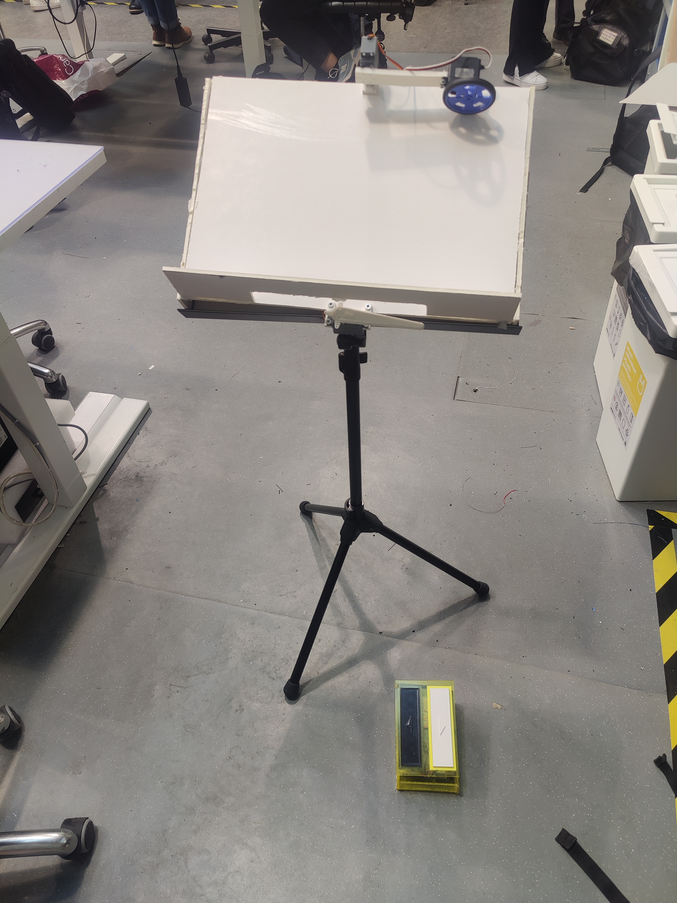

# 🎵 Note Flipper™ – Automatic Wireless Page Turner  

📄 [Project Presentation (PDF)](Noteflipper_presentation.pdf)

We will eradicate all awkward pauses for musicians.  
**Note Flipper™** is an automatic, wireless, fast, and portable page-turning device.  
It works with traditional paper notebooks, offering an alternative to digital interfaces while preserving a more authentic musical experience.  

---

## 📚 About the Project  
This project was developed as part of the **ELEC-C9801 – Design Thinking and Electronic Prototyping (5 ECTS)** course at Aalto University.  

Our team consisted of two members:  
- **Petteri** – Responsible for **electronics design and coding** (Arduino, servo control, Bluetooth integration).  
- **Teammate** – Responsible for **mechanical design and prototyping**.  

---

## ✨ Features
- 📖 Works with real paper sheet music  
- 🎛️ Wireless pedal control via Bluetooth  
- ⚡ Fast page flipping with servo motors  
- 🎶 Lightweight and portable for live performances  
- 🔋 Powered by standard power bank or battery  

---

## 🛠️ Components  

### Flipper Mechanism
- 1× Arduino Uno  
- 2× Servo motor HK 15138A  
- 1× Continuous Servo motor SM-S4303R  
- 1× Power Bank  
- 1× HC-06 Bluetooth module  

### Pedal Mechanism
- 1× Arduino Uno  
- 1× HC-06 Bluetooth module  
- 1× 9V battery  
- 2× Low-profile push buttons  

---

## 🖼️ Project Photos  

**Flipper mechanism prototype**  
  

## 🎥 Final Demo Video  

Watch the Note Flipper™ in action:  
[![Demo Video]](https://youtube.com/shorts/xP_R2LRWYwg?si=ddPaDGY_Lycr40Je)    

---

## 🚀 How It Works  
- The **pedal unit** sends a signal via Bluetooth when pressed.  
- The **flipper unit** receives the signal and triggers the servo motors.  
- A servo arm flips the paper to the next page instantly.  

---

## 🔮 Future Improvements
- Compact PCB design to reduce wiring  
- Rechargeable battery system  
- Adjustable speed and torque for different paper types  
- More ergonomic pedal design  

---
